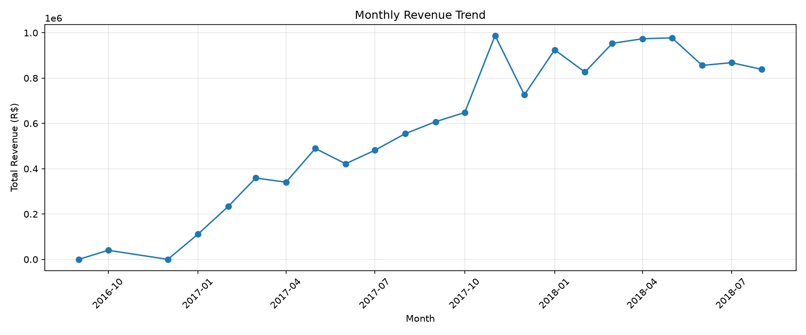
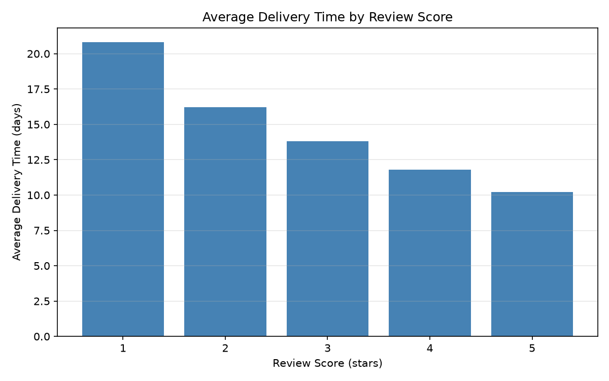
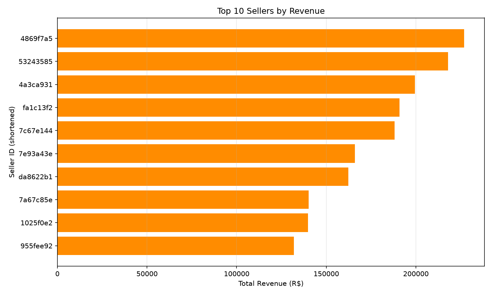
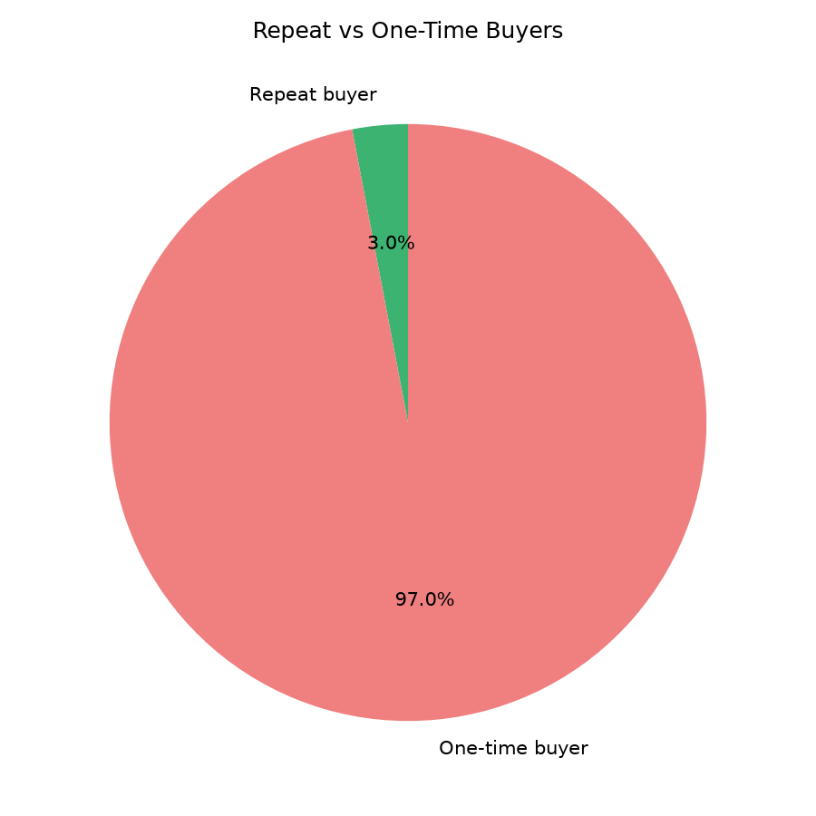

# Olist Retail Data Pipeline

An end-to-end data pipeline and analysis built on the **Olist Brazilian E-Commerce** public dataset — from raw CSVs to a structured PostgreSQL database to business-relevant SQL analytics.

**Stack:** Python (pandas, SQLAlchemy) · PostgreSQL · Jupyter · matplotlib

---

## Project Overview

Olist is a Brazilian e-commerce marketplace connecting small sellers to major online marketplaces. This project builds a realistic data pipeline around Olist's public order/customer/product data, then answers four real business questions using SQL.

**Goals:**
1. Design and populate a proper relational schema from 9 raw CSV files
2. Build a re-runnable (idempotent) ETL process, not a one-off script
3. Answer real business questions using SQL — not pandas — against the resulting database

---

## Data & Schema

Source: [Olist Brazilian E-Commerce Public Dataset](https://www.kaggle.com/datasets/olistbr/brazilian-ecommerce) (Kaggle)

9 linked tables — customers, orders, order_items, products, sellers, order_payments, order_reviews, geolocation, and a category translation table. Orders are the central table; order_items is one row per item within an order (many-to-one with orders), linking out to both products and sellers.

Full schema with primary/foreign keys: [`sql/schema.sql`](sql/schema.sql)

### Data quality issues found and handled

Real data is messy — here's what came up during exploration and how each was resolved:

| Issue | Finding | Resolution |
|---|---|---|
| Missing dates in `orders` | Nulls in delivery/approval timestamps | Confirmed these correspond to orders that hadn't reached that fulfillment stage (cancelled, still processing, etc.) — not data errors. Left as `NULL`, filtered by `order_status` at query time. |
| Missing product categories | 610 products with no `product_category_name` | Filled with `"unknown"` rather than dropped, to avoid orphaning related `order_items` rows. |
| Missing category translations | 2 categories (`pc_gamer`, `portateis_cozinha_e_preparadores_de_alimentos`) existed in `products` but not in the official translation table | Auto-detected and added to the translation table to satisfy the foreign key, rather than hardcoding a fix. |
| Duplicate geolocation rows | 261,831 of 1,000,163 rows were exact duplicates | Deduplicated to one row per zip code prefix (19,015 unique prefixes remained). |
| Non-unique `review_id` | 814 review IDs appeared on two different orders, with identical review content | Investigated rather than dropped — found this reflects genuine cases of one review being tied to multiple orders. Used a composite primary key (`review_id`, `order_id`) instead of assuming duplicate/bad data. |

---

## ETL Pipeline

[`etl/etl.py`](etl/etl.py) extracts all 9 CSVs, applies the cleaning steps above, and loads them into Postgres in dependency order (parents before children, to satisfy foreign keys). The script is **idempotent** — it truncates existing data (in reverse dependency order) before each reload, so it can be safely re-run without creating duplicates or crashing on conflicts.

---

## Analysis & Findings

All analysis queries are in [`sql/analysis/`](sql/analysis/), pulled into Python via `pd.read_sql()` for visualization only — all aggregation and business logic happens in SQL.

### 1. Sales Trend Over Time



Revenue grew steadily from early 2017 onward. One sharp anomaly stood out: **November 24, 2017 — Black Friday — saw 1,147 orders in a single day**, more than double the next-highest day that month. Order volume plateaued around 6,000–7,000 orders/month through mid-2018, suggesting the platform matured rather than continuing exponential growth.

### 2. Delivery Time vs. Review Score



| Review Score | Avg. Delivery Time |
|---|---|
| 1 ⭐ | 20.8 days |
| 2 ⭐ | 16.2 days |
| 3 ⭐ | 13.8 days |
| 4 ⭐ | 11.8 days |
| 5 ⭐ | 10.2 days |

A clean, monotonic relationship: 1-star orders took roughly **twice as long** to deliver as 5-star orders. This is correlational, not proof of causation — reverse causality is unlikely (delivery precedes the review), but delivery time may also be a proxy for regional service quality rather than the sole driver of dissatisfaction.

### 3. Seller Performance



Ranked sellers (min. 20 orders) by revenue, average review score, and average delivery time. Most top earners are well-reviewed (avg. 3.8–4.5 stars), and concentrated in São Paulo state. One notable exception: a top-5 seller by revenue had a below-average review score (3.35) paired with the slowest delivery time in the top 20 (21.9 days) — directly consistent with the delivery/review relationship found above, and a concrete, actionable flag for a real business (this seller's shipping process warrants review).

### 4. Customer Retention



Only **3.0%** of customers (2,801 of 93,358) placed more than one order. The dataset's top spenders by total value were almost entirely one-time buyers of expensive items, not loyal repeat customers — total spend and customer loyalty are not the same thing here. Given Olist's marketplace model (many independent sellers, often selling infrequently-repurchased goods like furniture or electronics), a low repeat rate is unsurprising, but represents a clear growth lever: retention is a largely untapped opportunity.

---

## Limitations & Further Work

- Findings are correlational; no causal claims are made about delivery time and reviews.
- Repeat-purchase rate is analyzed in aggregate — a natural next step would be to break it down by product category (e.g., consumables vs. one-off big-ticket items) to see if retention varies systematically.
- The `geolocation` table was deduplicated by simply keeping the first entry per zip code; averaging coordinates would be a more precise approach for any mapping work.

---

## Repo Structure

```
olist-retail-pipeline/
├── README.md
├── data/raw/                  (CSV files, gitignored)
├── sql/
│   ├── schema.sql
│   └── analysis/
├── etl/
│   └── etl.py
└── notebooks/
    └── 01_exploration.ipynb
```
